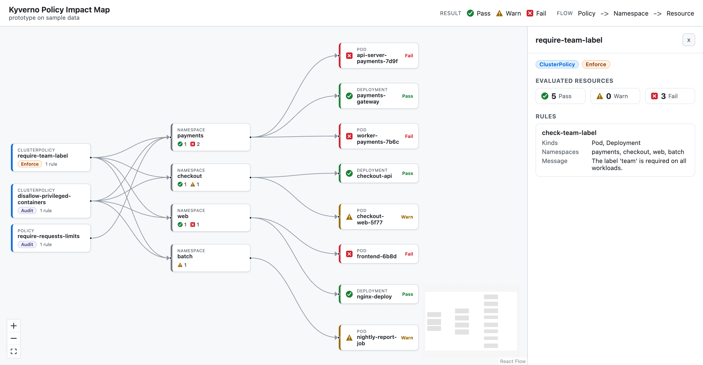
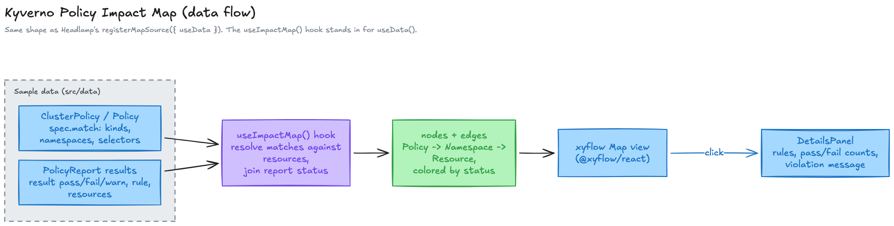

# kyverno-impact-map

[](https://kyverno-impact-map.pages.dev)


React and `@xyflow/react` app that renders Kyverno policies as an impact graph, `ClusterPolicy`/`Policy` to `Namespace` to `Resource`, with resource nodes colored by `PolicyReport` result. Runs on sample data.

Live: https://kyverno-impact-map.pages.dev



## Model

- `kyverno.io/v1` `ClusterPolicy` / `Policy`, `spec.rules[].match`/`exclude`, `spec.validationFailureAction`. `src/data/policies.ts`
- `wgpolicyk8s.io/v1alpha2` `PolicyReport`, `results[]` with `policy`, `rule`, `result`, `severity`, `message`, `resources[]`. `src/data/policyReports.ts`

Sample set is 3 policies, 4 namespaces, 8 resources. Status is drawn by color, shape, and icon, so it reads without color alone. Clicking a node opens a detail panel with the policy rules and pass/fail counts, the results on a resource, or a namespace's status counts.



`useImpactMap()` groups `PolicyReport` results by policy, namespace, and resource, picks the worst status per resource, and returns `{ nodes, edges }` for `@xyflow/react`, the graph library Headlamp uses for its Map view.

## Run

Node 20 or newer.

```bash
npm install
npm run dev      # http://localhost:5173
```
